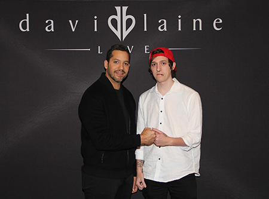
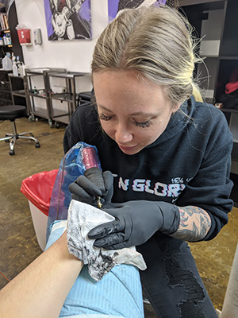
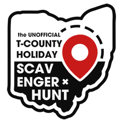
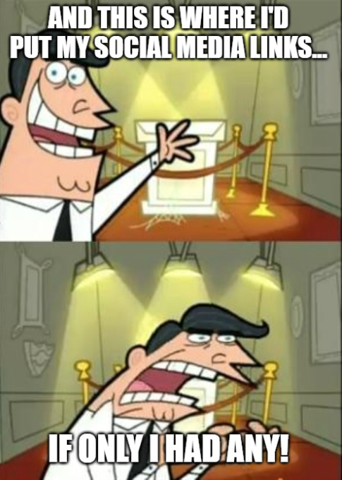

---
# Feel free to add content and custom Front Matter to this file.
# To modify the layout, see https://jekyllrb.com/docs/themes/#overriding-theme-defaults

title: Home - MicHorvath.com
layout: default
---

<link rel="stylesheet" type="text/css" href="/assets/css/index.css">

    <section id="main-image-container" class="b-lazy" data-srcset="assets/media/main-bg-lowres.jpg 1024w" data-src="assets/media/main-bg.jpg">
        

            

            

                

            

        

    </section>
    

    <section id="timeline-container">
        

        

            <ul>
                <li>
                    

                        2008
                    

                    

                        
Started programming

                        
Like most 13-year-olds, I wanted to be a game developer. Thanks to various blogs and tutorials, I began using <a taget="_BLANK" href="https://www.yoyogames.com/gamemaker">GameMaker</a> and <a taget="_BLANK" href="https://unity.com/">Unity</a> to learn to program. My life has been a downward spiral ever since.

                    

                </li>
                <li>
                    

                        2009ish
                    

                    

                        
Made my first game! 🕹️

                        
After some trial and error, I managed to finish my first "real" game project and share it with the GameMaker Sandbox (RIP). The project was a poorly designed puzzle game called "Blinded by Sound" where the player controlled a dying cosmic light in a blacked-out world. To traverse each puzzle in the dark you had to use some of your light to send out echolocation-esque bursts of light that would expand outward temporarily lighting up obstacles in your path, but use this power too frequently and risk extinguishing your light. The game had far too many levels and wasn't all that interesting to play, but I finished it!

                    

                </li>
                <li>
                    

                        April 7th, 2014
                    

                    

                        
Started a full-stack web development job at <a target="_BLANK" href="https://www.laureninnovations.com">Lauren Innovations</a>

                        
After building multiple small game projects and switching over the web development, I started a new job at Lauren Innovations working on NaviGate Prepared — a web-based emergency preparedness software suite for K-12.  Utilizing a variety of technologies such as but not limited to: PHP, Python, Angular, React.js, Node.js, Web Sockets, PostgreSQL, and Less, I helped develop and maintain a collection of safety-related products with an awesome team.

                    

                </li>
                <li>
                    

                        2015
                    

                    

                        
Built & buried Jobobo ⚰️

                        
Jobojo was my first large scale attempt at a technology "startup". Teamed up with one of my Lauren co-workers who would go on to work for Poppin, we designed and built an original web-based job finding site with a unique premise: chat roulette but with job interviews. Prospective hirees would be matched up with employers in real-time events for their 5 minutes of fame. A slew of complicated additional features caused scope creep that combined with a lack of funding sank this project before it had a chance to sail.

                    

                </li>
                <li>
                    

                        April 8th, 2016
                    

                    

                        
🌮

                    

                </li>
                <li>
                    

                        June 17th, 2017
                    

                    

                        
Started my own arcade business

                        
Not only have I always loved video games, but I always had quite the penchant for arcades. After winning a lil green alien bouncy ball at an arcade with my best friend and watching an <a target="_BLANK" href="https://www.youtube.com/watch?v=wOlcB-JxkFw">inspiration GDC talk</a>, I bought my first arcade machine. A few days later I incorporated. Over the next 12 months, I bought and sold dozens of arcade games from all over the country.  I managed leases as I expanded my route and my dad helped me restore the machines I purchased to provide the best quality for my customers. Unfortunately, when you don't rig your games, charge very little, pay lots of "gambling" taxes, and give away high-quality American made prizes, you don't exactly make a killing.

                    

                </li>
                <li>
                    

                        December, 2017
                    

                    

                        
Met David Blaine 🤯

                        

                    

                </li>
                <li>
                    

                        2018
                    

                    

                        
Found my Affinity ❤️

                        
The completely unrelated spiritual successor to Jobojo. My next large tech project was a fresh take on the online dating scene. I worked with multiple freelancers, a product design team, and a few small businesses to work on what I still believe could be the future of online dating. It is more effective, safer, cheaper, and much more fun than what is currently available in the market. The project is currently on hiatus but will be coming back in a big way soon. I will share more via the blog.

                    

                </li>
                <li>
                    

                        June, 2018
                    

                    

                        
Worked on the PATH

                        
People Available To Help. A web/mobile solution to help those reentering society get the help they need based on their specific needs. Don't have an ID? Need a place to live? Want to get connected with the local church? The PATH app would curate a unique set of helpful contacts for the user to aid in their journey to success. I was brought on by some friends to build the web portal and help with API implementation.

                    

                </li>
                <li>
                    

                        April, 2019
                    

                    

                        
Became a <a target="_BLANK" href="https://www.thinkful.com/">Thinkful</a> Technical Expert

                        
This was an incredibly exciting and albeit unexpected side hustle that I embarked on for a short while. I wouldn't describe myself as an exuberant people person, so teaching students 1-on-1 to become full-stack web developers was definitely outside of my comfort zone. I learned a lot and had a terrific experience. It's funny honestly, I thought that I was teaching my students, but they were the ones teaching me. I had to leave sooner than expected due to some unforeseen personal problems, but I would love to do it again.

                    

                </li>
                <li>
                    

                        November, 2019
                    

                    

                        
Lauren Innovations was aquired and merged with Alice to become Navigate360

                        
Unexpectedly, Lauren Innovations was purchased and combined with Alice and Safeplans to become Navigate360, the superpower of school safety! We went from 20ish employees to 160+ in a matter of weeks.

                    

                </li>
                <li>
                    

                        November 17th, 2019
                    

                    

                        
Tattooed by <a target="_BLANK" href="http://www.meganmassacre.com/">Megan Massacre</a>

                        
 Best. Day. Ever.

                    

                </li>
                <li>
                    

                        December, 2019
                    

                    

                        
Organized the 1st (and only) UNOFFICIAL T-County Holiday Scavenger Hunt

                        
 Thought up, planned, and executed in only 30 days, the scavenger hunt was born. 25 kind of holiday-related clues leading to real-world locations and a cash prize. I managed to get 10+ local businesses and organizations to help with the community event. A custom-built website hosted via AWS allowed hunters to input clues they discovered based on the hints that were posted on the scavenger hunts Twitter. Many strangers participated and the website received 200+ hits per day.  Clues were buried in concrete, hung from buildings, written on cakes, broadcast on the radio, and even stolen by unidentified college employees. While the event didn't quite unfold as planned, no one was hurt and no one got arrested, so I would call it a success!

                    

                </li>
                <li>
                    

                        Present
                    

                    

                        
Exploring exciting new possibilities!

                        
As always, I am open to trying new things, exploring new career opportunities, and continuing to learn/grow as a developer. Want to hire me? <a href="mailto:aaahh@michorvath.com">Shoot me a message!</a>  P.S. I am currently opening a vegan donut shop, coming soon...

                    

                </li>
            </ul>
        

        

        <footer>Mic Horvath © {{ 'now' | date: "%Y" }}. All rights reserved. Powered by <a href="https://jekyllrb.com" rel="nofollow">Jekyll</a></footer>
    </section>
    

        Scroll Down 
        
    

